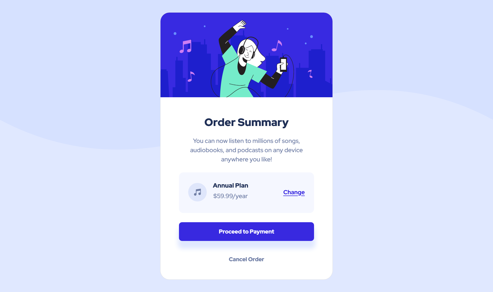

## Table of contents

-   [Overview](#overview)
-   [The challenge](#the-challenge)
-   [Screenshot](#screenshot)
-   [Links](#links)
-   [Built with](#built-with)
-   [Author](#author)

## Overview

This challenge is designed based on the provided template from Frontend Mentor which help us improve our coding skills by building realistic projects.

### The challenge

Users should be able to:

-   See hover states for interactive elements

### Screenshot

### Links

-   Solution URL: [Order Summary Card](https://github.com/Albrt78/ordersummary.github.io)
-   Live Site URL: [Order Summary Card](https://albrt78.github.io/ordersummary.github.io/)

### Built with

-   Semantic HTML5 markup
-   CSS custom properties
-   Mobile-first workflow
-   [Bootstrap5](https://getbootstrap.com) - CSS framework

## Author

-   Frontend Mentor - [@Albrt78](https://www.frontendmentor.io/profile/Albrt78)
